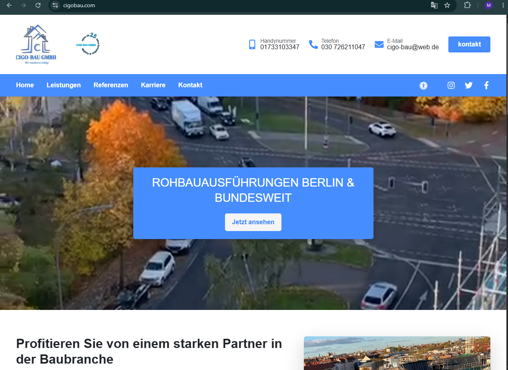
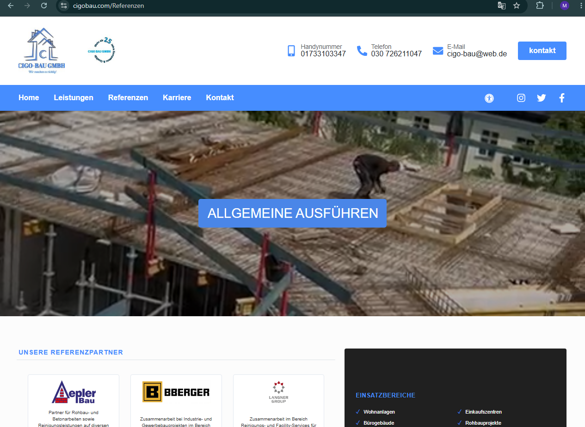
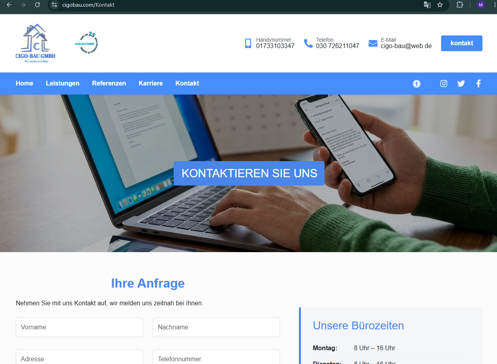

# CIGobau Website

<p align="center">
  <a href="https://cigobau.com" target="_blank">
    
  </a>
  <a href="https://github.com/sohelsamy1/cigobau-website" target="_blank">
    
  </a>
</p>

<p align="center">


</p>

<p align="center">


</p>

## 🚀 Overview

A modern and fully responsive **company portfolio website** built with **React.js** and **Vite**, featuring reusable components, responsive navigation, multiple content pages, accessibility support, SEO optimization, interactive UI elements, and EmailJS contact form integration.

---

## ✨ Key Features

- Modern & responsive design
- Mobile sidebar navigation
- Reusable React components
- Services page
- References page
- Career page
- Contact page
- EmailJS contact form integration
- SEO optimization
- Accessibility support
- Swiper sliders
- Responsive date picker

---

## 🌐 Live Demo

**https://cigobau.com**

---

## 🛠️ Tech Stack

| Technology | Purpose |
|------------|---------|
| React.js | Frontend Framework |
| Vite | Build Tool |
| Bootstrap 5 | Responsive Grid & UI Utilities |
| React Router DOM | Client-side Routing |
| React Icons | UI Icons |
| React Bootstrap Icons | Bootstrap-style Icons |
| Swiper | Interactive Sliders |
| React Datepicker | Date Selection |
| EmailJS | Contact Form Integration |
| React Helmet Async | SEO Meta Tags |
| CSS3 | Custom Styling |
| HTML5 | Markup |

---

## 📸 Screenshots

### 🏠 Home Page



---

### ⭐ References Page



---

### 📞 Contact Page



---

## 📁 Project Structure

```text
src
├── assets
├── components
├── pages
├── App.jsx
├── App.css
├── index.css
└── main.jsx
```

---

## ⚡ Getting Started

### Clone Repository

```bash
git clone https://github.com/sohelsamy1/cigobau-website.git
```

### Enter Project

```bash
cd cigobau-website
```

### Install Dependencies

```bash
npm install
```

### Start Development Server

```bash
npm run dev
```

### Build for Production

```bash
npm run build
```

---

## 📌 Project Highlights

- Clean React architecture
- Mobile-first responsive layout
- Accessible user experience
- Interactive UI components
- Clean and maintainable codebase
- Well-structured project organization
- Smooth multi-page navigation
- Responsive layouts across devices
- Consistent and professional UI
- User-friendly interface
- Scalable component structure
- Optimized frontend implementation
- Reusable and scalable UI components

---

## 👨‍💻 Author

**Sohel Samy**

**Laravel | React | Vue Developer**

- **Portfolio:** https://sohelsamy.com
- **GitHub:** https://github.com/sohelsamy1
- **LinkedIn:** https://linkedin.com/in/sohelsamy

---

<p align="center">
Built with ❤️ using React.js & Vite
</p>